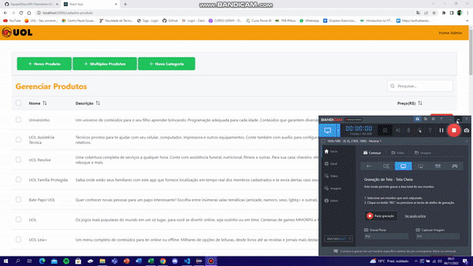
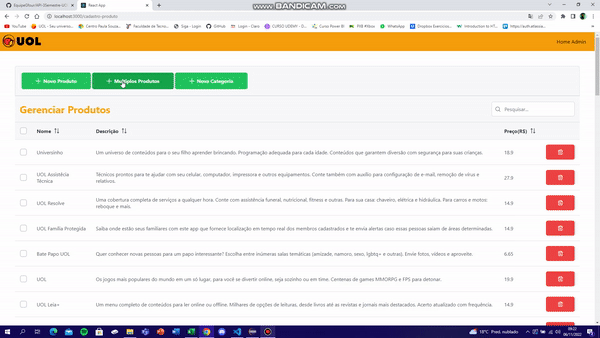
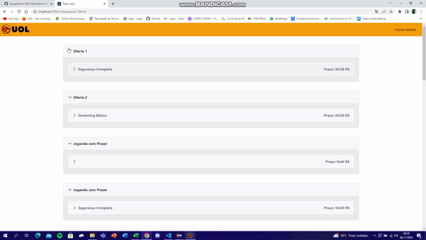
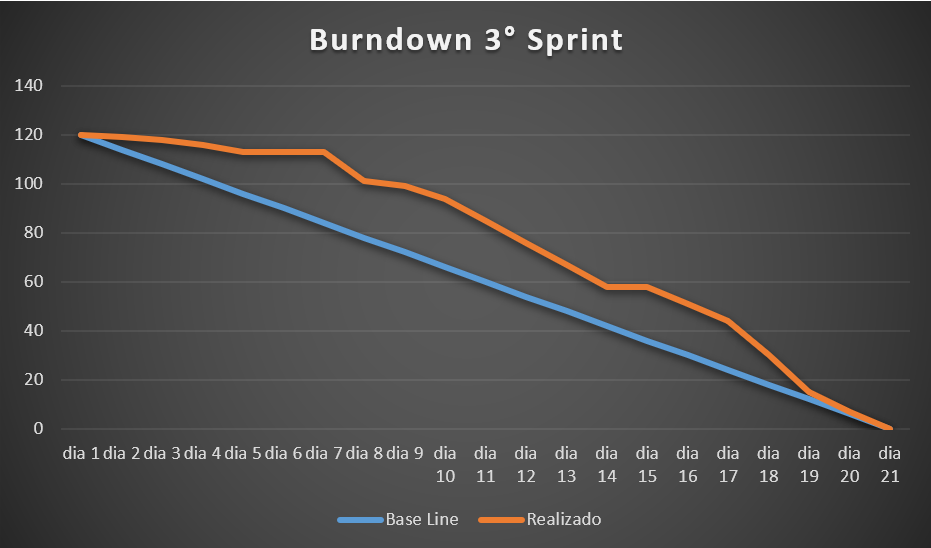

<h1 align="center"> Sprint03 - 17/10 à 06/11 </h1>
 

    <a href="#Objetivo">Objetivos da Sprint</a>  |  
    <a href="#entregas">Requisitos</a>  |
    <a href="#burndown">Burndown</a>  |
    <a href="#links">Links Úteis</a>  |      
    <a href="#tecnologias">Tecnologias</a>  |    

<h2> 🎯 Objetivo da Sprint</h2>

Requisitos Funcionais abrangidos nessa Sprint:

- **RF 01:** Produtos e Categorias no Sistema;
- **RF 03:** Promoções com Multiplas Ofertas;
- **RF 04:** Interface e Lógicas Administrativas.

Requisitos Não Funcionais abrangidos nessa Sprint:

- **RNF 01:** Utilizar TypeScript;
- **RNF 02:** Utilizar Java;
- **RNF 04:** Documentação.

 

<h2> 📑 Requisitos</h2>

### RF 01: Produtos e Categorias no Sistema:
Nessa terceira sprint, implementamos o cadastro multíplo de produtos e categorias no sistema de forma simples, rápida e intuitiva.
 

### RF 03: Promoções com Multiplas Ofertas:
Foram desenvolvidas e implementadas as funções administrativas de gerenciamento e cadastro de Promoções e Ofertas.
 

### RF 04: Interface e Lógicas Administrativas:
Desenvolvido front-end de visualização dos Pacotes e Ofertas.
 

<h3>:gear: Demonstração da Aplicação</h3>

Cadastro Categoria Multipla:
<h1 align="center">
</h1>
 

Cadastro Produto Multiplo:
<h1 align="center">
</h1>
 

Criação e Gerenciamento de Ofertas e Promoções:
<h1 align="center">
</h1>
 

Visualização Geral de Ofertas:
<h1 align="center">
</h1>
 

<h2>:chart_with_downwards_trend: Burndown da Sprint</h2>

<h1 align="center">
</h1>
 

<h2>:card_file_box: Links Úteis</h2>

Link do Repositório do Front-End: https://github.com/EquipeGfour/API-UOL---frontend

Link do Repositório do Back-End: https://github.com/EquipeGfour/API-UOL---Backend

Link do Repositório do Geral: https://github.com/EquipeGfour/API-3Semestre-UOL
 

<h2>:wrench: Tecnologias Utilizadas</h2>

 Comunicação 

 
 

 Desenvolvimento 

 
    
 

 

 
 → [Voltar ao topo](#topo)